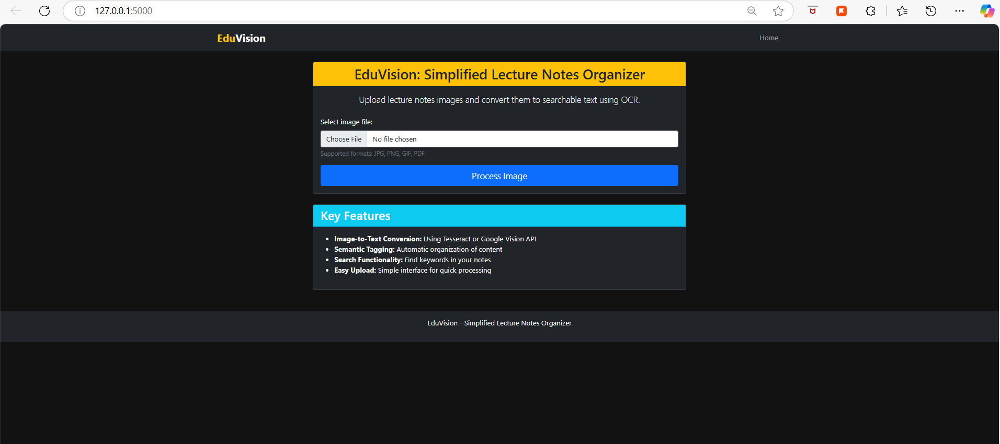
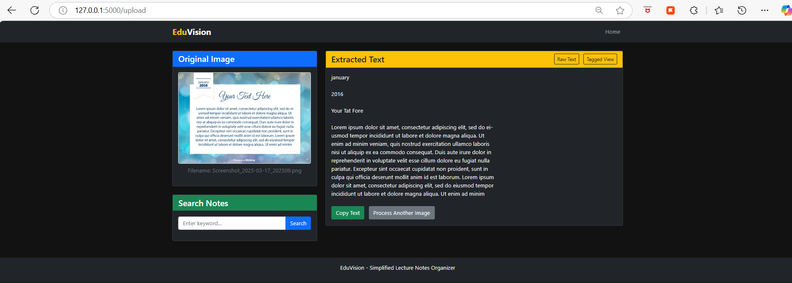
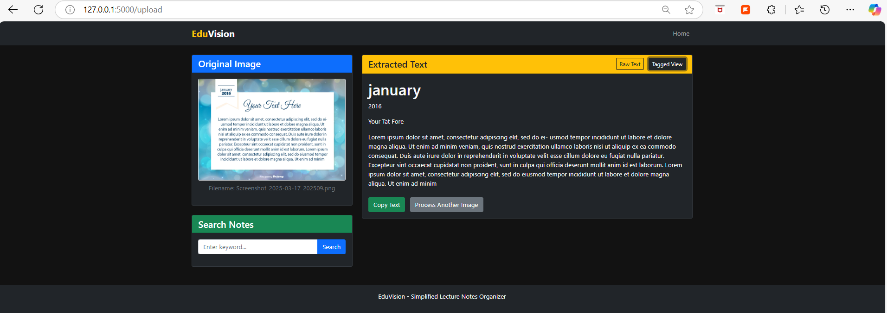

# EduVision: Simplified Lecture Notes Organizer

📌 **Overview**  
EduVision is a web-based application that helps students organize lecture notes by converting images to searchable text using Optical Character Recognition (OCR). It enables students to upload lecture notes and search through them efficiently.

---

🚀 **Features**  
- **OCR-based Text Extraction:** Uses Tesseract or Google Vision API to convert images to searchable text.  
- **Tagging & Organization:** Allows users to categorize notes using tags.  
- **Search Functionality:** Enables keyword-based searching through uploaded notes.  
- **User-Friendly Interface:** Simple and intuitive UI for ease of use.  

---

🛠️ **Tech Stack**  
- **Frontend:** HTML, CSS, JavaScript  
- **Backend:** Python (Flask)  
- **OCR:** Tesseract OCR / Google Vision API  
- **Database:** SQLite (can be extended to PostgreSQL)  

---

📂 **Project Structure**  
```
Edu_Vision/
│-- app/
│   ├── static/
│   │   ├── css/
│   │   ├── images/
│   │   ├── js/
│   │   ├── uploads/
│   ├── templates/
│   │   ├── base.html
│   │   ├── error.html
│   │   ├── index.html
│   │   ├── results.html
│   ├── __init__.py
│   ├── ocr_service.py
│   ├── routes.py
│-- venv/
│-- .env
│-- config.py
│-- main.py
│-- requirements.txt
│-- README.md
```

---

🔧 **Installation & Setup**  
### **Prerequisites**  
- Python (>= 3.8)  
- Git  
- Virtual Environment (optional but recommended)  

### **Steps**  
1. **Clone the Repository**  
```sh
git clone https://github.com/rakshashetty66/Edu_Vision.git
cd Edu_Vision
```

2. **Create Virtual Environment (Optional but Recommended)**  
```sh
python -m venv venv
source venv/bin/activate  # On Windows use: venv\Scripts\activate
```

3. **Install Dependencies**  
```sh
pip install -r requirements.txt
```

4. **Run the Application**  
```sh
python main.py
```

5. **Access the Web App**  
Open your browser and go to:  
```
http://127.0.0.1:5000/
```

---

🎯 **Usage**  
1. **Upload an image of your lecture notes.**  
2. **EduVision extracts text using OCR and saves it for searching.**  
3. **Use the search bar to find keywords in your notes.**  

---

📸 **Screenshots**  
### Home Page  


### Dashboard Page - Raw Text
 

### Dashboard Page - Tagged View


---

🛡️ **Future Improvements**  
- Add AI-based summarization for lecture notes.  
- Implement cloud storage integration for better accessibility.  
- Enhance UI/UX for a more seamless experience.  

---

🤝 **Contributing**  
Contributions are welcome! Feel free to fork the repo, create a new branch, and submit a PR.  

---

📄 **License**  
This project is licensed under the MIT License.  

---

📞 **Contact**  
For any queries or suggestions, reach out to:  
- **Email:** raksharshetty46@gmail.com  
- **GitHub:** [rakshashetty66](https://github.com/rakshashetty66)  

---

🚀 **Organize your lecture notes effortlessly with EduVision!**  
